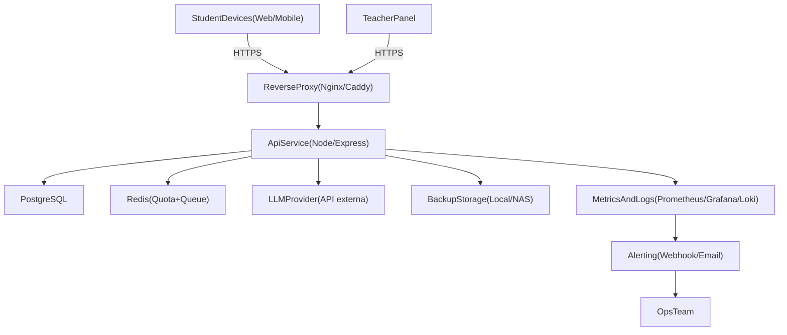

# Blueprint On-Prem Mínimo - Piloto IRIS

## Objetivo

Definir la arquitectura técnica mínima para operar el piloto con seguridad, observabilidad y control de coste.

## Topología lógica

## Componentes obligatorios

- `reverse-proxy`: terminación TLS, rate limit base por IP y encaminamiento.
- `api-service`: lógica de negocio, guardrails, cuotas y escalado de seguridad.
- `postgres`: persistencia de sesión, auditoría e incidentes.
- `redis`: control de burst, cola de peticiones IA y límites por aula/sesión.
- `observability`: métricas, logs y alertas operativas.
- `backup`: snapshots de BBDD y copias cifradas.

## Dimensionado mínimo (fase 1)

### Nodo principal (recomendado)

- CPU: 8 vCPU
- RAM: 16 GB
- Disco:
  - 250 GB SSD para sistema y servicios,
  - 200 GB adicionales para datos y backups locales de corto plazo.

### Distribución sugerida por servicio (límite)

| Servicio | CPU límite | RAM límite |
|---|---:|---:|
| Reverse proxy | 0.5 vCPU | 512 MB |
| API Node | 3 vCPU | 4 GB |
| PostgreSQL | 2 vCPU | 6 GB |
| Redis | 1 vCPU | 2 GB |
| Observabilidad | 1.5 vCPU | 3 GB |

## Alta disponibilidad mínima realista (budget-aware)

- Objetivo 99.9% limitado a horario lectivo.
- Estrategia mínima:
  - backups diarios,
  - procedimiento de restauración probado,
  - restart automático por health checks.
- Estrategia deseable (si hay margen):
  - nodo secundario caliente para API + réplica de datos.

## Red y seguridad

- Segmentación en red local:
  - VLAN servicios,
  - VLAN administración,
  - acceso externo solo por proxy.
- Firewall:
  - abrir exclusivamente `443`,
  - bloquear acceso directo a Postgres/Redis desde red de usuarios.
- Secretos:
  - variables de entorno fuera de repositorio,
  - rotación trimestral de claves API.

## Configuración de datos

- PostgreSQL:
  - WAL activado,
  - autovacuum monitorizado,
  - política de retención alineada con documento de datos.
- Redis:
  - TTL obligatorio para cuotas y colas transitorias,
  - sin persistencia de contenido sensible largo plazo.

## Observabilidad y SLO

- Métricas mínimas:
  - latencia p95 API,
  - error rate,
  - cola Redis,
  - consumo IA mensual,
  - saturación CPU/RAM/disco.
- Alertas mínimas:
  - API down > 1 minuto,
  - p95 > 2.5 s por 5 minutos,
  - error rate > 3%,
  - disco libre < 15%.

## Backups

- Frecuencia:
  - backup lógico diario,
  - snapshot semanal completo.
- Retención:
  - diarios 30 días,
  - semanales 8 semanas.
- Pruebas:
  - restauración mensual con evidencia.

## Runbooks mínimos

- Reinicio seguro de servicios.
- Recuperación ante caída de base de datos.
- Degradación controlada en pico de tráfico.
- Protocolo de incidente de seguridad IA.

## Checklist de preparación técnica

- [ ] Proxy TLS activo con certificado válido.
- [ ] API con health checks y límites de cuota.
- [ ] PostgreSQL con backup automático validado.
- [ ] Redis con TTL en claves de cuota/cola.
- [ ] Dashboards y alertas operativas en producción.
